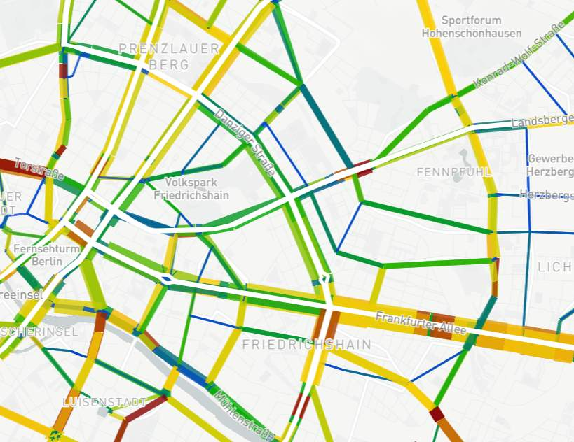

# Chapter 11

CHAPTER 11.0 HOUSEHOLD SURVEY CODING AND GEOCODING

Let's add some links:

- [TF Resource home page](https://tfresource.org)
- Or you can link to the [history page](History_of_travel_surveys)

**Here is an image:**

Note: Significant components of this chapter come from Stopher et al.’s (2008) NCHRP Report, Chapter 2.5 and Tierney et al.’s FHWA Manual Introduction (Cambridge Systematics 1994), Chapters L and Z. Other key contributors are Celia Boertlein, Michael Greenwald, Martin Trepanier and Elaine Murakami.

Common socioeconomic indicators (e.g., household income levels, auto mobile ownership rates), employment requirements (e.g., work shift times), and life-style characteristics (e.g., children in daycare) all contribute to our insight into how and why people travel. In much of the analysis of survey data, such as the number of trips per household in each income range, a trip is a single event and is counted as one unit. However, the fundamental factor which underlies the use of transportation systems is geography. Origin-destination patterns define how many people are traveling in individual corridors, and how many people are in the market to use individual highway facilities or transit services, and how many people converge on downtowns or suburban activity centers. Therefore, travel survey data must be linked geographically.  In this chapter, the coding of survey data is addressed, especially geographic data (origin and destination locations) that have to be geocoded.   

## 11.1 Coding Survey Data

This section addresses the coding of non-geographic data and the coding of complex variables.

### 11.1.1 Missing Values, Use of Zero, Etc.

There is considerable variability in how missing data are recorded in transport surveys and even variability within the same survey. The issues in this item, which are discussed in detail in Section 8.3 of the Technical Appendix, relate to standardizing the ways in which missing data are flagged and how zeroes and blanks are to be used in coding. 

It is recommended that the following standardized procedures be adopted together as a group because adoption of some without others will actually increase ambiguities in the data:

1.      No blanks: Blanks should never be a legitimate code, and all data fields must contain alphanumeric data.

2.      Missing data: Missing data—whether as the result of a respondent refusal, an indication that the respondent does not know the answer, or as a legitimate skip of the question—should receive a coded numeric value. These values should be negative values (because negative values will not normally occur in a data set except as income) and should be -99 for a refusal. For “don’t know” responses, it should be set as -98. For legitimate skips or non-applicability of a question, the value -97 should be entered.

3.      Correspondence between numeric values and codes: In any question where a legitimate response could be zero, the code for that response will be the number zero (0). This will normally apply to any question requesting a count of elements, where a count of zero is possible—e.g., number of workers in the household, number of children in the household, number of infants in the household, number of cars available to the household, etc. In like manner, the count that is the response will be the coded value in all cases.

4.      Coding the number of person trips reported: In all personal travel surveys that seek to ascertain trip-making behavior of individuals, the person record should contain a count of the number of trips reported by the individual. A count of 0 is to be used only to indicate the response that the person did not travel on the diary day. If no travel information was provided, then the value coded should be -99.

5.      Coding binary variables: The principal binary variables in personal travel surveys are yes/no responses and responses to gender. For questions to which the response is either “yes” or “no,” the response of “yes” is coded as 1 and the response of “no” is coded as 2. For response to the gender question, “male” is 1 and “female” is 2.

### 11.1.2 Coding Complex Variables

This item is concerned with how to code the responses to certain types of questions involving categories that may vary from survey to survey, depending on the level of detail required for a specific survey. Among the questions that fit within this category of variables are income and activity.

- This is my main contribution.
