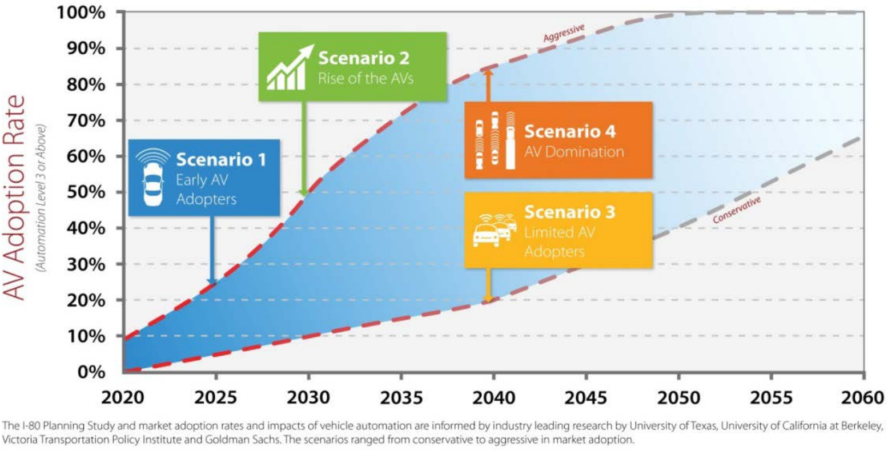
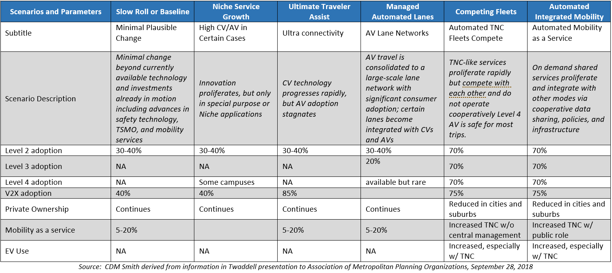
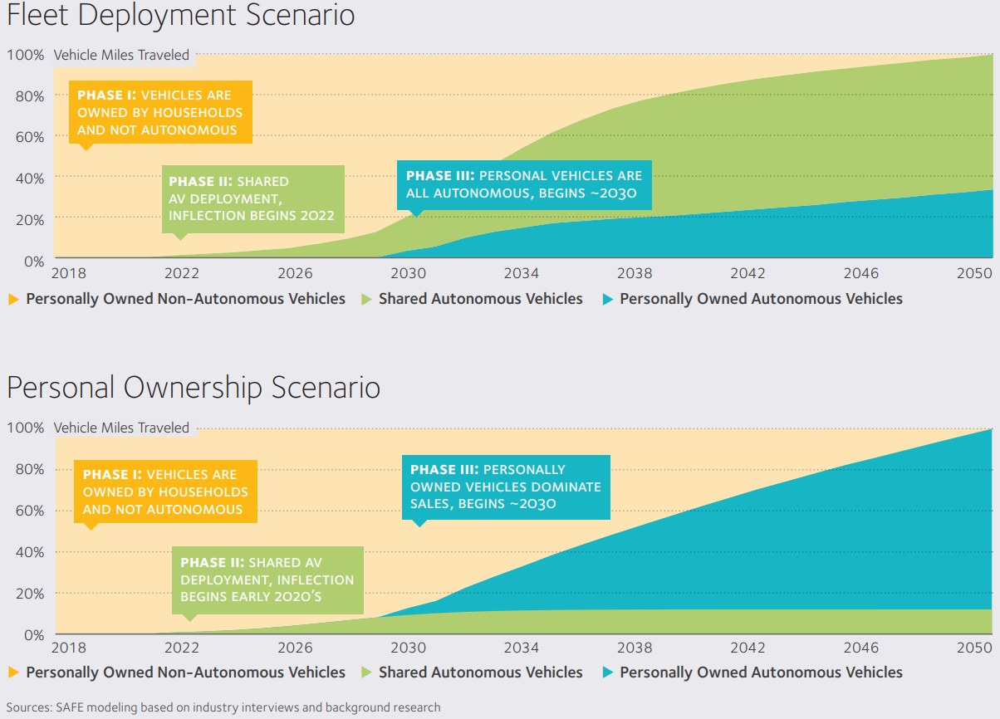

CAV Penetration Rates in the Literature
----------------------------------------

Shladover and Greenblatt (2017) noted that impact estimates are very sensitive to assumptions about the extent of usage of AV technologies, and noted three uncertainties related to market penetration:
 - Pace of technological maturity
 - Rate of inclusion of technology in new vehicles and retirement of old vehicles
 - Extent of use of technology by consumers
 
Talebian and Mishra (2018) provide a comprehensive overview of past research on adoption rates of technology innovations including CAVs. They note that research and projected rates have been based on past technology implementations, expert knowledge of CAV technologies and projection methods, and analytical modeling. Their particular research was on the Theory of Diffusion in which communications among peers and through social networks and advertising over time helps increase adoption rates of any technology. 
 
Gordon, Kaplan et al (2018) in their analysis based on past technology adoption take issue with some other researchers who predict that the introduction of AVs will mostly take place through the shared economy and reduce the proportion of private vehicle ownership. Based on the introduction of computers, smart phones, and similar products, the authors take a position that private ownership of AVs is likely to continue for a long period of time (a number of decades), leading to higher vehicle miles travelled (VMT) than some other researchers estimate. The authors used a threshold model that showed for numerous older technologies that Individuals learn about technologies from trend-setters, but then make the decision about whether to adopt themselves. The personal decision is influenced by differences in a person needs and circumstances as well as external events such as accidents. The authors found that more cars are likely to be purchased by individuals than TNCs, at least for many decades.  Geographic dispersion of the population, even with some cities showing a resurgence in their population, tends to favor AV use. In addition, auto companies are likely, as they have in the past, to produce multiple models and versions of AVs to appeal to the various types of car buyers.  And there will be new users of AVs such as the disabled or young. The authors identified several reasons why penetration rates and AV ownership may take longer to occur.
 - Private ownership will continue, decreasing interest in shared AVs
 - VMT will increase with AVs
 - AV penetration may be slowed by political and regulatory issues
 - Accidents may slow evolution of AV technology
 
Zmud et al, 2018 included a chapter on uncertainties associated with CAVs that will affect the ability to predict when CAVs will be widely deployed. The uncertainties they listed include:
- The cost of the technology will certainly drive the rates of adoption.
- Whether the technology is used in privately held vehicles or through private corporations supplying fleet services will drive the rate of market penetration.
- On-road testing of CAVs continues, but actual usage safety statistics and experience will drive public attitudes about the technology.
- Comfort and convenience, in addition to cost, will drive consumer preferences regarding AVs.
- Roadway and parking infrastructure will need to be adapted to CAVs.
- Government policy and traffic laws, including tests of liability in the court system, will undoubtedly drive market penetration scenarios.
- The technology will certainly advance and change, and features will be added or subtracted on the basis of cost effectiveness in the market.

The Zmud report emphasized the uncertainty about CAV development. Their review of the literature, which was corroborated by the study team for this current report, found high uncertainty in published deployment scenarios. They defined three “eras” during which varying but increasing rates of CAV penetration will occur:
1.	CAVs are developed and tested.
2.	Consumers begin to adopt CAVs.
3.	CAVs become the primary means of transport.

### Summary

Most of the studies that address variations in market penetration percentages, chose a wide range of hypothesized market penetration levels, without underlying analyses to consider the mechanisms of market growth and the constraints on rate of market growth. This is a significant limitation in virtually all the published literature that cites a range of market penetrations for CAVs or AVs because there is no scientific data available to show when the more advanced CAV features will be introduced to the market, nor how quickly their shares of new vehicle purchases or actual usage on the road will grow. 

Studies that rely on analogies to the information technology (IT) industry and the growth of markets such as mobile phones fail to account for the fundamental differences between mobile phones and vehicles in terms of capital costs, product development cycle length, and durability of the product itself. Studies of the rate of change in the vehicle market have shown that major high-cost automotive features such as automatic transmissions and air conditioning took several decades to advance from market introduction on a few premium vehicles to becoming standard equipment on all new vehicles. Even after automotive features dominate the new vehicle market, it takes additional decades for the vehicle fleet to turn over so that they dominate the population of vehicles on the road (for example, the average age of vehicles on the road in the U.S. is about 12 years). These factors were accounted for in the report by Shladover and Greenblatt (2018), which showed a very large range of uncertainty between the optimistic and pessimistic predictions of the usage of a variety of CAV features in the years 2030 to 2050.

CAV Adoption Scenarios in Published Planning Efforts
-------------------------------------------------------

This section discusses some of the approaches that have been taken to modeling future CAV scenario approaches in published planning efforts.

The state of Iowa, with consultant HDR, in its study of the I-80 corridor used four scenarios to represent different AV penetration rates (Interstate 80 Planning Study (PEL) Iowa DOT, 2017). From its review of literature, Iowa DOT and HDR concluded that AV technologies can lead to major improvements in safety, accessibility and capacity. As a result, the level of AV technology adoption (Level 3 and above) was selected as a key factor in the scenario planning, along with 3 other key factors:  millennial travel behavior, smart truck parking, and aging population. In terms of AV adoption rates, scenarios 1, 2, and 4 assumed “aggressive” adoption whereas scenario 3 was “conservative.” The adoption rate for scenario 1 assumed 20% adoption of AVs in 2025, scenario 2, 50% in 2030, scenario 3, 20% in 2040, and scenario 4, 85% in 2040. It should be noted that adjustments for the impacts of AVs were made in the analysis tools based on modeling results in the literature, specifically in number of trips, vehicle miles traveled, roadway capacity and crash frequency. The scenarios are shown in the figure below: 

For FHWA, ICF has studied the impacts of the adoption of AVs.  They created six adoption scenarios to which they applied scenario planning exploratory modeling techniques to look at the impacts variations in AV penetration rates for 2035.  The scenarios and the ICF analysis techniques were discussed in a September 2018 presentation to the Association of Metropolitan Planning Organizations (Twaddell, 2018). ICF made assumptions about the extent of adoption of vehicles with Automation Level 2, 3, and 4, and in two of the scenarios assumed increases in shared use vehicles for increased mobility as a service. Table below describes the scenarios and the various technology adoption rates in each scenario.  

Amitai Bin-Nun, Alex Adams, and Jeffrey Gerlach (2018)  America’s Workforce and the Self-Driving Future: Realizing Productivity Gains and Spurring Economic Growth is a compilation of AV-related impact analysis that explores the impacts on jobs in the U.S. as AVs are implemented, including new transportation-related jobs as well as jobs lost to advancing technology and how AVs are used – and the timeframe in which that implementation occurs. Figure below was drawn from the report’s discussion of truck and private car automation. The figure and the analysis contrast private ownership with shared use of AVs in fleets, but both analyses were based on unrealistically optimistic assumptions about the maturity of the technology needed to support the higher levels of automation.

Liu, H., Kan,et al (2018c) used several penetration rates to analyze the effect of CAVs on roadway capacity. This study assessed the traffic impacts at each possible market penetration. The report found that penetration rates lower than about 60% did not result in much road improvement, but that 100% penetration increased capacity by 90%. As will be discussed in subsequent sections of this report, and as noted from several sources cited earlier in this section, additional research is needed to incorporate AV characteristics into traffic modeling. What is clear from the literature cited is that there are multiple factors that influence the timeline for full AV implementation. 

References
==========

CDM Smith (2019). CAV Traffic Simulation Literature Review

Talebian and Mishra (2018)  Predicting the adoption of connected autonomous vehicles: A new approach based on the theory of diffusion of innovations  University of Memphis

Shladover and Greenblatt (2017)  Connected and Automated Vehicle Concept Dimensions and Examples  Lawrence Berkeley National Laboratory USDOE  December 2017

Gordon, Kaplan, Zarwi, Walker, Zilberman The Future of Autonomous Vehicles: Lessons from the Literature on Technology Adoption, U Cal Berkeley for CALTRANS June 2018

Amitai Bin-Nun, Alex Adams, and Jeffrey Gerlach (2018)  America’s Workforce and the Self-Driving Future: Realizing Productivity Gains and Spurring Economic Growth Securing America’s Energy Future  June 2018

Vince Bernardin 2018 Scenario Modeling and EMA for CAVs  RSG  September 14, 2018

Liu, H., Kan, X. (David), Shladover, S. E., Lu, X. Y., & Ferlis, R. E. (2018c). Modeling impacts of Cooperative Adaptive Cruise Control on mixed traffic flow in multi-lane freeway facilities. Transportation Research Part C: Emerging Technologies, 95(December 2017), 261–279. https://doi.org/10.1016/j.trc.2018.07.027

Iowa DOT and HDR. Interstate 80 Planning Study (PEL)  June 2017

Twaddell, Hannah (2018)  Scenario Planning for Connected and Automated Vehicles  ICF September 26, 2018

[Content Charrette: Autonomous Vehicles](Content_Charrette_Autonomous_Vehicles)
