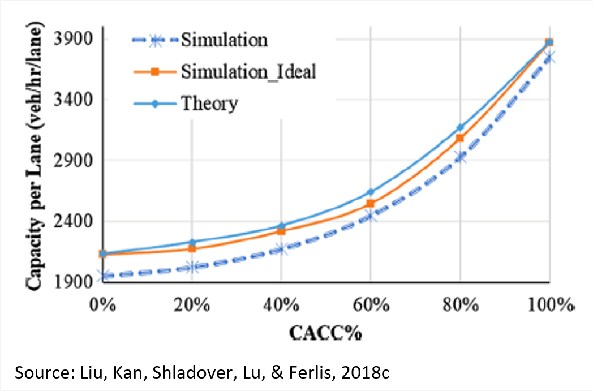
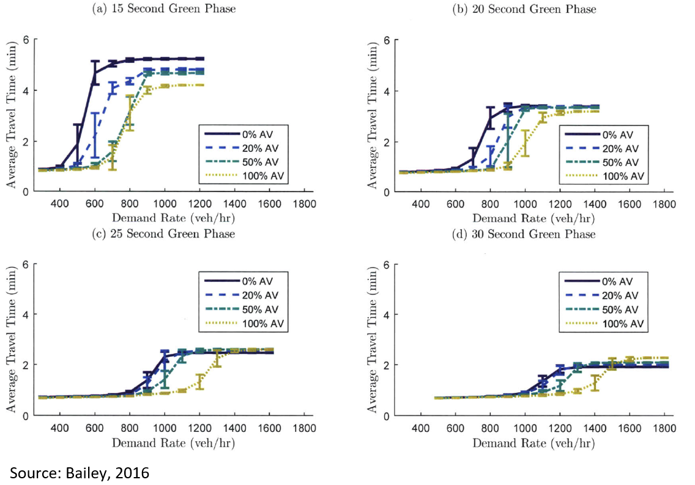

Impact of CAV on Traffic Operations
-------------------------------
The areas of impact of CAVs on traffic operations were categorized as follows (Zmud et al, 2018):
 - Transportation cost
 - Transportation safety
 - Vehicle operations (including capacity changes, congestion, and other traffic impacts)
 - Energy use and related emissions 
 - Personal mobility and convenience (including shared, owned, or rented vehicles)

Transportation cost is a very uncertain impact area. Costs of vehicles that include highly automated technology will need to be recouped by OEMs, so the cost per vehicle is likely to increase. However, the cost per trip may decline if fleet services of AVs prevail in the market. Thus, the overall transportation cost to the consumer is uncertain and is most likely tied to vehicle ownership versus distributed vehicle ownership, vehicle club membership, or ridesharing.

The safety impacts of CAVs include an expected reduction in crashes, which should increase the utility of AVs, which would increase their market share. Improved reliability would also increase the utility of the network performance itself by encouraging users to travel farther as trip and tour planning becomes more consistent.

Much research has focused on the impact of connecting vehicles through DSRC into platoons of vehicles. The overall impact of better connected and more automated vehicles would be to increase capacity, dramatically shorten headway space and thereby improve coordinated acceleration and vehicle throughput, although operations that involve platoon formation and dissolution may decrease capacity (Zmud et al, 2018). This section discusses these and other impacts in more detail.

<b>Capacity</b>

Some studies have estimated that CAVs have the potential to improve the capacity of the highway due to the shorter time headways which they can maintain in a platoon or Cooperative-Adaptive Cruise Control (CACC) string and the more stable vehicle-following dynamics. However, this is highly dependent on the market penetration rate, traffic volume, traffic management strategies, and the automated system capability. At low market penetration rates CAVs appear to have limited impact on capacity of the roads since platooning would be challenging due to the low number of CAVs. However, with the help of traffic management strategies, the possibility of CACC string formation and consequently the capacity could be increased. Moreover, CACC is not the only advanced technology implemented in vehicles. Systems such as automated merging or lane changing assistance, and speed harmonization should be deployed together with CACC to best exploit the benefits of the technology.

The figure below gives a representative view of theoretical capacity impacts on homogeneous freeway segments based on market penetration.

Although CACC is a Level 1 automation system, the results reported for its effects on traffic flow should also be relevant for higher levels of automation that combine automated car following with additional automation functions. The car following effects are expected to dominate the effects of other automation functions.

<b>Congestion</b>

CAVs are expected to decrease congestion considering the higher capacity which will be achieved due to the shorter time headways maintained by these vehicles. However, the mitigation in congestion is unlikely to occur with low penetration rates of CAVs. In fact, without proper traffic management strategies, a negative impact on congestion can also be expected. A case study in Austin, Texas (Zhao, 2017) demonstrates this theory, where reduction in the value of travel time, operating costs and parking cost make travelers more likely to choose AVs over regular vehicles and buses. As a result, VMT increases more than 20% followed by associated congestion delays. 

On the other hand, at high penetration rates and specially at high traffic demands, research shows that CAVs have a significant effect in mitigating congestion. A simulation study in Antwerp, Belgium (Makridis et al., 2018) shows that at penetration rates above 60% and high traffic demand, CAVs could improve traffic density and average speed and also prevent bottlenecks.

Moreover, dedicating a lane to AVs can help to improve the congestion. But this is highly dependent on the utilization policy of this lane and also the penetration rate of CAVs. If a lane is dedicated to AVs when their market penetration is too low, it will be under-utilized and the remaining general-purpose lanes over-utilized, so the number of dedicated lanes needs to be carefully matched to the population of AVs that can use those lanes (Talebpour, Mahmassani, & Elfar, 2017).

<b>Traffic Stability</b>

Van Arem, Van Driel, and Visser (2006) examined whether CACC can improve traffic stability in a four-lane highway with a lane drop via a traffic simulation study using MIXIC, a microscopic traffic simulation model developed by the Netherlands Organization for applied research (TNO) and the Dutch Ministry of Transport, Public Works and Water Management for the study of Autonomous Intelligent Cruise Control (AICC), a concept similar to CACC. 

At high market penetration rates (>60%) of CACC, improvement in traffic stability and throughput was simulated. When a lane was dedicated to CACC vehicles, low CACC penetration rates (< 40%) led to a degradation of performance, demonstrated by lower speeds, higher speed variances, and a higher incidence of shockwaves. However, the study estimated that at high penetration rates (>60%) CACC may improve traffic stability by reducing speed variances, but only in high-volume flow upstream of bottlenecks. Outcomes were found to vary, however, depending on the policy relating to utilization of the dedicated CACC lanes (i.e. whether usage by CACC vehicles was optional or mandatory). Other researches also resulted in similar findings. In conclusion, research shows that CACC-equipped vehicles can increase traffic stability and this enhancement is more evident when the penetration rate is high (>60%).

<b>Travel Time</b>

Research has demonstrated that CAVs and AVs can reduce the travel time due to their behavior: smaller headways, and accurately tracking the speed profile of the lead vehicles. The introduction of CAV technologies such as CACC that permit short following headways is likely to reduce travel times because those shorter following headways will enable free flow speeds to be maintained at higher traffic volumes. As an example, a 9% reduction in travel times was simulated in a VISSIM microsimulation study assuming 100% market penetration (Aria, Olstam, & Schwietering, 2016). Similar studies suggest that CAVs may reduce travel time on merging roadways as well (Rios-torres and Malikopoulos, 2017). 

Another simulation study (Bailey, 2016) examined the impact AV penetration rate may have on the average travel time at an isolated signalized intersection. Travel time was examined in scenarios varying the AV penetration rates and green phases as a function of demand rate. The results indicated that as AV penetration increases, average travel times for vehicles decreases. Specifically, when assuming 15 seconds of green time and a demand rate of 600 vehicles per hour, travel times were reduced by 53% and 80% when AV penetration was assumed to be 20% and 100%, respectively. These results are shown in the figure below.

Moreover, dedicating a lane for CAVs allows for a higher possibility for platooning. As a result, not only the travel time of CAVs will be decreased, but also the travel time of the entire vehicle fleet will be affected positively when the CAV penetration rate is equal or higher than saturating a lane (Ivanchev, Knoll, Zehe, Nair, and Eckhoff, 2017).

<b>Travel Safety</b>

Simulation studies have predicted that AVs and CAVs can increase safety and decrease the possibility and severity of accidents by eliminating human driving errors, smoothing the traffic and deterring shockwave formation and consequently stabilizing the traffic. However, these findings need to be viewed with great caution. These studies have been based on use of simulations that do not represent safety-critical traffic situations, and they adapt Surrogate Safety Assessment Models that were derived from human responses rather than automated driving system responses. Furthermore, none of these analyses represents the new crashes that will be caused by failures of the automation systems. The literature lacks evidence-based research on AV safety resulting from field test experiments since CAVs are not yet deployed widely on the road network. 

<b>Value of Travel Time</b>

Value of travel time may be reduced as an impact of AVs regarding the fact that travelers can be involved with other tasks than driving. However, this may not necessarily increase the productivity of the travelers during the trip, as some travelers are willing to continue watching the road when riding with an AV. The satisfaction of travelers caused by riding an AV would reduce the cost of travel time. Findings from related studies show that the value of travel time is highest for manually driven vehicles, followed by shared-AVs, and lowest for privately-owned AVs.
 
 
<b>Fuel Efficiency and Emission</b>

It is expected that CAVs will reduce fuel consumption and emissions due to their smoother driving behavior, closer headway between vehicles, and also reducing congestion. Because of CAVs’ access to preview information about the motions of multiple preceding vehicles, they are less likely to frequently accelerate or decelerate hard, which increases emissions. 

On the other hand, the enhanced comfort provided by CAVs could potentially increase the VMT and consequently fuel consumption and emissions (Rodier, 2018). But it is also quite possible that more AVs will be electric vehicles which would decrease fuel use and emissions. In conclusion, there is no clear evidence to show what the net effect of CAVs will be on the fuel efficiency and emissions in the long term. 

References
==========

CDM Smith (2019). CAV Traffic Simulation Literature Review

Aria, E., Olstam, J., & Schwietering, C. (2016). Investigation of Automated Vehicle Effects on Driver’s Behavior and Traffic Performance. Transportation Research Procedia, 15, 761–770. Retrieved from https://doi.org/10.1016/j.trpro.2016.06.063

Bailey, N. K. (2016). Simulation and Queueing Network Model Formulation of Mixed and Non-automated Traffic in Urban Settings. Retrieved from https://dspace.mit.edu/bitstream/handle/1721.1/107069/971130623-MIT.pdf?sequence=1

Ivanchev, J., Knoll, A., Zehe, D., Nair, S., & Eckhoff, D. (2017). Potentials and Implications of Dedicated Highway Lanes for Autonomous Vehicles, 1–12. Retrieved from http://arxiv.org/abs/1709.07658

M. Makridisa, K. Mattasa, B. Ciuffoa,*, M. Raposoa, T. Toledob, C. Thiela (2018) Connected and Automated Vehicles on a freeway scenario. Effect on traffic congestion and network capacity. 7th Transport Research Arena TRA 2018. Retrieved from https://ec.europa.eu/jrc/sites/jrcsh/files/connected-automated-vehicles-traffic-congestion-network-capacity_111621.pdf

Rios-torres, J., & Malikopoulos, A. A. (2017). Impact of Connected and Automated Vehicles on Traffic Flow. 2017 IEEE 20th International Conference on Intelligent Transportation Systems (ITSC). Retrieved from https://doi.org/10.1109/ITSC.2017.8317654

Rodier, C. (2018). Travel Effects and Associated Greenhouse Gas Emissions of Automated Vehicles A White Paper from the National Center for Sustainable Transportation About the National Center for Sustainable Transportation, (April). Retrieved from https://ncst.ucdavis.edu/wp-content/uploads/2015/10/NCST_Rodier_Automated-Vehicles-White-Paper_APRIL-2018.pdf

Talebpour, A., Mahmassani, H. S., & Elfar, A. (2017). Investigating the Effects of Reserved Lanes for Autonomous Vehicles on Congestion and Travel Time Reliability. Transportation Research Record: Journal of the Transportation Research Board, 2622, 1–12. Retrieved from https://doi.org/10.3141/2622-01

Van Arem, B., Van Driel, C. J. G., & Visser, R. (2006). The impact of cooperative adaptive cruise control on traffic-flow characteristics. IEEE Transactions on Intelligent Transportation Systems, 7(4), 429–436. Retrieved from https://doi.org/10.1109/TITS.2006.884615

Zhao, Y. ; K. M. K. (2017). Anticipating the Regional Impacts of Connected and Automated Vehicle Travel in Austin, TX, 1–13.

Zmud, Williams, Outwater, Bradley, Kalra, and Row (2018). Updating Regional Transportation Planning and Modeling Tools to Address Impacts of Connected and Automated Vehicles, Volume 2: Guidance, TRB’s NCHRP  Report 20-102(09)  25319

Content Charrette: Autonomous Vehicles
