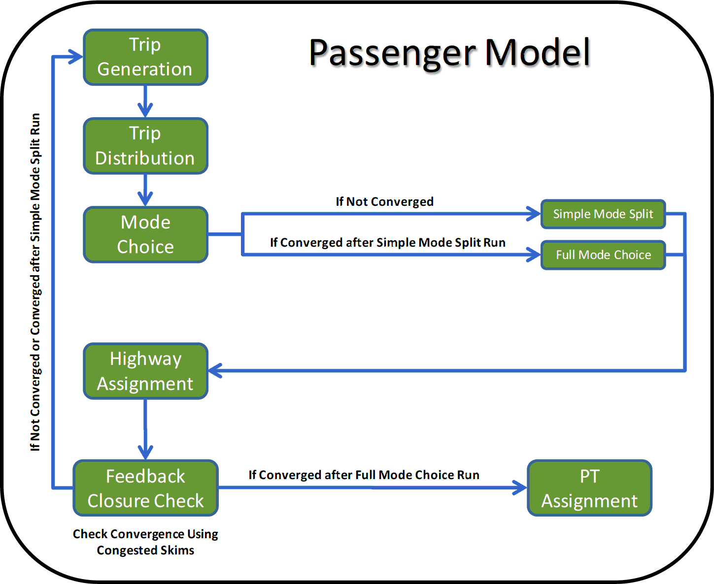
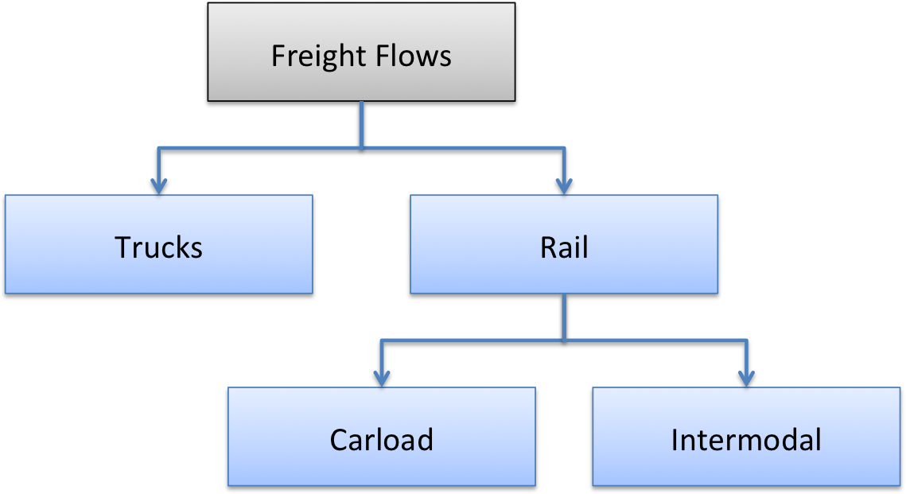

##Introduction

The Georgia Statewide Model is a state-of-practice transportation model. Like many contemporary statewide models it covers the entire country, with con-siderable network and zonal detail within Georgia, reduced detail in the five adjacent states, and substantially reduced detail beyond them. It includes both person and freight flow models that estimate demand separately, but use a combined traffic assignment procedure to estimate traffic volumes and travel times.

The Georgia Statewide Model follows the [four-step](Trip_based_models) sequential travel forecasting process widely used in the practice of urban and statewide modeling. This model does not distinguish time-of-day periods but assigns daily volumes. A high-level description of the Georgia Statewide Model can be found on this website[^1].

##Person Travel

Like most statewide models the level of zonal and network detail is coarser than in urban models. A total of 2,242 traffic analysis zones (TAZs) cover the continental U.S., 1,715 of which are within the 159 counties in Georgia. Travel demand within Georgia is modeled both for persons and freight travel demand. The person travel model was estimated and calibrated using data from the 2008 Georgia add-on to the National Household [Travel Survey](Travel_Survey_Data) (NHTS). A distinction is made between short and long-distance travel markets. The former are defined as trips less than 75 minutes in duration. Four trip purposes were defined for each travel market:

-   Home-based work (HBW)
-   Home-based other (HBO)
-   Non-home-based (NHB)
-   Commercial

Cross-classification models were developed to estimate daily trip productions as a function of household size and auto availability. Households are stratified by urban versus rural location (a zonal attribute), as well as low versus *non-low* income. An allocation process is used to assign total households in each zone to these strata. The graphic below shows a flowchart of the Georgia person travel demand model.

\
*Flowchart of the Person Travel Model Source: Atkins (2011: 30)[^2]*

Trip productions are calculated by multiplying the number of households by the average number of observed trips (from the NHTS) for each strata. Linear regression models of trip attractions have been defined separately for each trip purpose, each using a different combination of employment, population, and number of households in each zone as independent variables. The parameters were iteratively adjusted during calibration, as data on trip attraction relationships are not available from the NHTS. The total attractions are scaled to equal total productions for each trip purpose. The trip rates are further adjusted based on an accessibility measure that captures the differences in trip-making between urban and rural residents. This is a novel approach not typically found in statewide models.

Trip distribution is used to predict the likely destinations of the generated trips. A gravity model was developed for the internal trip purposes. The [impedance](Impedance) function includes estimates of intrazonal and interzonal travel time, as well as terminal times based upon employment density in the origin and destination TAZs. The distribution models were calibrated to rep-licate the NHTS average trip lengths and shape of the trip length frequency distributions. The models appear to replicate the NHTS well for short-distance trips. However, the small number of observations for long-distances trips in the NHTS precludes a confident appraisal of how well that travel market is represented within the model.

An intercity mode choice model allocates the total travel to competing modes. The data in the NHTS is not adequate for model estimation, so a model structure and parameters were adopted from an earlier version of the California high-speed rail (HSR) model (Cambridge Systematics, 2006[^3]). The constants in the model were then calibrated to reproduce observed Georgia mode shares summarized from FAA air traveler and Amtrak passenger counts and long-distance auto trips from the 1995 American Traveler Survey (ATS). A set of distance filters from airports and Amtrak stations is also used to restrict access to those modes from travelers with trip ends far from them. The resulting model is used for trips with at least one end within Georgia. Fixed mode shares are used for all other long-distance trips (e.g., those passing through Georgia).

##Freight Travel Demand

The demand for freight travel is estimated using the same steps as for person travel. The model was estimated using the Global Insight Transearch database. Transearch is a proprietary national estimate of commodity flows based upon a combination of public and private sources. These data are available at the county level across the country. The data used for model estimation were aggregated into 56 districts of one or more counties and the 16 commodities most dominant in the state. A step-wise linear regression was used to correlate employment with annual tonnage produced (productions) and consumed (attractions). These models were estimated at three levels of geography:

-   Short-range (within Georgia)
-   Medium-range (between Georgia and adjacent states)
-   Long-range (between Georgia and non-adjacent states)

Special generators for two counties (Chatham and Fulton) were added to capture the dynamics associated with large distribution centers in each county and the ocean port in Chatham County. A gravity model is used for trip distribution. As in the person trip distribution model, an exponential function using distance was used to calculate impedance for each combination of commodity and level of geography. Medium and long-distance trips were further differentiated by direction of flow (i.e., internal-external versus external-internal). The average distances from the model match the Transearch data.

An incremental logit model was developed for the freight mode choice component, again based upon the Transearch data. The existing mode shares are used as the basis, with changes triggered by changes in travel cost by mode. The mode shares for air and waterborne commodity flows are assumed to be invariant over time, such that the model is in essence a truck-rail diversion model. The choice tree is shown in the flowchart below.

*Nesting of the Georgia statewide freight mode choice model*

The upper-level rail nest is further divided into carload and intermodal movements. Prior to assignment, the commodity flows (in annual tons) are converted into truckload equivalents using data from the 2002 Vehicle Inventory and Use Survey (VIUS). Conversion factors by commodity and distance range were used for this purpose.

##Assignment

The daily travel demand of both the person and freight components are combined and assigned to the network of the statewide model. A multi-class static user equilibrium assignment model is used for this purpose. Generalized cost as a function of link travel times and vehicle operating cost expressed in equivalent minutes is used for calculating link impedances. Estimates of peak period travel times are used when assigning short-distance flows. Off-peak travel times were used for medium and long-distance flows. A feedback loop from the assignment to trip distribution is used in the model to cycle through the process until the interzonal travel times become stable. During the intermediate cycles, a simplified person mode choice model is used to achieve fast computer run times. The model is rerun with the full mode choice model after convergence is obtained in the feedback loop.

##References

------------------------------------------------------------------------

[^1]: GDOT Statewide Travel Demand Model, http://www.dot.ga.gov/IS#tab-3

[^2]: Atkins (fomerly PBS&J) (2011), “Development of Statewide Model Report”, Atlanta: Georgia Department of Transportation.

[^3]: Cambridge Systematics, Inc. (2006) “Bay Area/California High-Speed Rail Ridership and Revenue Forecasting Study: Interregional Model System Development.” (Available online at <http://www.hsr.ca.gov>)

