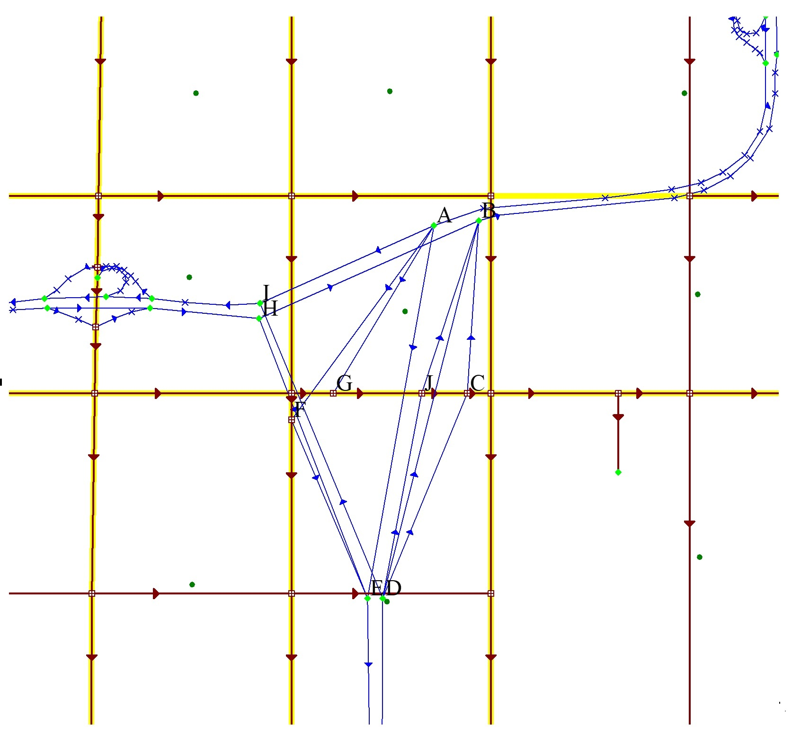

Objective
---------

Hybrid models combine the best aspects of a regional-type travel model with the best aspects of a traffic microsimulation in order to provide a high level of spatial and temporal detail for project forecasts. Hybrid models work best for projects where the microsimulation covers a small subarea of the region. NCHRP Report 765 illustrates hybrid modeling by showing how OD tables may be transferred from a regional model to a microsimulation of a whole freeway system for a large city. However, a true hybrid model should contain two-way feedback between its two components, so that consistency can be maintained throughout the hierarchy.

Background
----------

NCHRP Report 765 contains an overview of hybrid modeling, but the report lacks specific guidance. Regional-type travel models, even those with dynamic traffic assignments, are inherently macroscopic in their estimates of delay. Microsimulation techniques are now regarded as being superior to macroscopic techniques for accurately depicting a traffic system. However, traffic microsimulations are often very difficult to set up, and their execution times can be long. Therefore, it is usually practical only to apply a microsimulation to a small portion of the whole traffic network. This section emphasizes the use of hybrid models as an enhanced form of subarea focusing. Software products for implementing hybrid models are not yet mature, so the implementation of hybrid models requires considerable expertise and lead-time.

Guidelines
----------

Hybrid models are recommended only for high profile or expensive projects, such as a reconstructed freeway-to-freeway interchange, and for other high-impact situations for which traditional modeling methods are considered to be inaccurate.
Microsimulations are composed of random events, so results can vary from run to run. It may be necessary to repeat a microsimulation many times to achieve suitable reliability.

Different microsimulation models take different forms of input. This section assumes that a microsimulation can accept its demands in the form of an OD table from and to highway locations. The OD table may be dynamic.
Different microsimulation models create different forms of output. This section assumes that a microsimulation can create an OD matrix of travel times between highway locations.

An interface must be developed to transmit an OD table from the travel model to the microsimulation, and a separate interface must be developed to transmit an OD travel time matrix from the microsimulation to the travel model. This interface needs to overcome inherent differences in how microsimulation and travel forecasting models define origins and destinations.

The setup of a hybrid model is illustrated here by example, following guidelines by Burghout (2004). Essentially, OD pairs in the microsimulation correspond to “virtual” links in the travel forecasting model. Refer to the Milwaukee/Mitchell window network from NCHRP Report 765 (see [Windowing with OD table estimation from traffic counts](Windowing_with_OD_table_estimation_from_traffic_counts_in_project_level_traffic_forecasting)). This figure shows the Mitchell interchange before a recent reconstruction. The actual geometric configuration of the interchange is unimportant to the travel model, except that improvements in the interchange would eliminate congestion hot spots and affect travel times. If the reduction in congestion is sufficiently large, then there might be an effect on travel demands throughout the freeway system and on parallel arterials. However, the travel modeling software is not capable of accurately estimating delays within a complex interchange.

The interchange should be replaced in its entirety by a suitable number of “virtual” OD links. In this example there are just six such links for the freeways because the Mitchell Interchange is only 3-way. Each “virtual” link is an OD pair. However, there are connections to arterial streets that also are part of the interchange that must be included in the microsimulation for a complete analysis. Impermissible movements are excluded. The figure below shows the network, zoomed-in, with all of these new “vitrual” links. No attempt is made to make these links look realistic or connect internally within the interchange. There are possibilities for other OD patterns, not already on the ground, that have been ignored for now. These are all one-way links; some situations might require two-way links.

Milwaukee/Mitchell Window with the Mitchell Interchange Replaced by “Virtual” OD Links
.

The microsimulation deals only with the interchange in isolation from the rest of the network. All relevant origins and destinations for the microsimulation have been labeled with upper case letters, A though J, in this figure. The volume on each “virtual” link is an OD flow for the microsimulation; the travel time on each “virtual” link is an OD travel time from the microsimulation. The interfaces between the two software packages is software dependent.
For subareas with internal trip generation, there is a need to include links, representing centroid connectors, to all locations at the cordon of the subarea.

Advice
------

More comprehensive hybrid models, where the microsimulation covers a large portion of the travel network, are less readily implementable at this time.
Traffic assignments should be equilibrium. Because of the random results from the microsimulation and the inability to define a closed-form travel-time/volume function for the OD links, chose MSA as the equilibrium traffic assignment method. MSA will tend to smooth out variations in link volumes owing to random variations in OD travel times. The microsimulation should be repeated at least once at each equilibrium iteration.

Consider performing several runs of the microsimulation so that random variations in OD travel times can be smoothed by taking an average.

Items to Report
---------------

-   Traffic volumes in and around the hybrid subarea
-   Traffic speeds in and around the hybrid subarea
-   Measures of effectiveness for the travel network
-   Measures of effectiveness for the hybrid subarea
-   OD volumes for the subarea
-   OD travel times for the subarea

References
----------

NCHRP Report 765

Wilco Burghout, “Hybrid Microsocipic-Mesoscopic Traffic Simulation”, Doctoral Dissertation, Royal Institute of Technology, Stockholm, Sweden, 2004.

